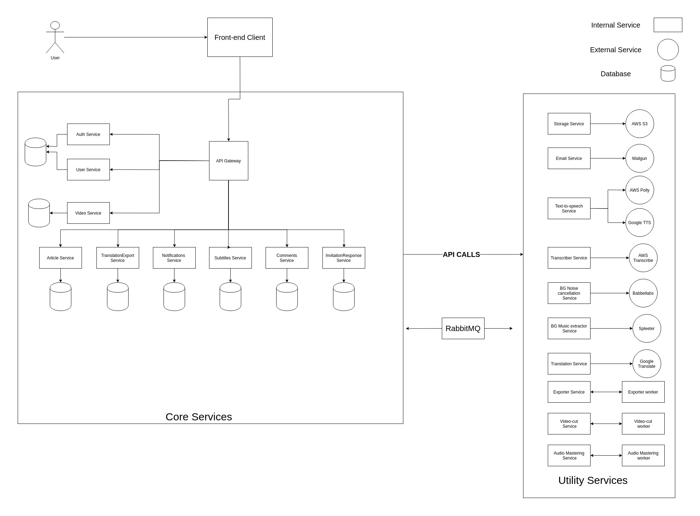
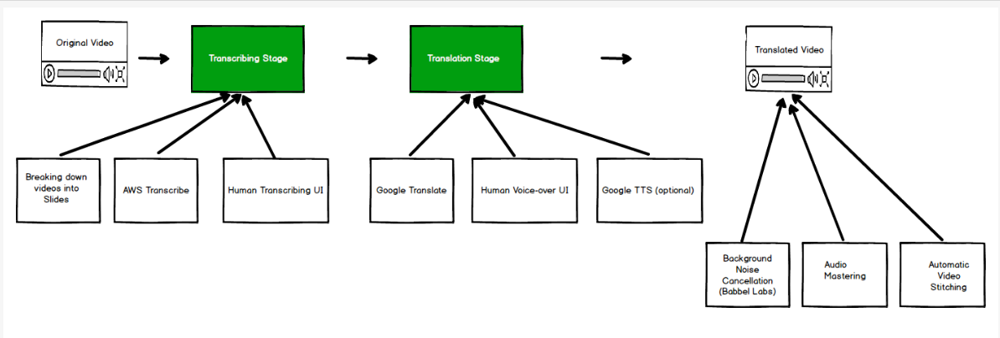

Please follow this guide to set up Videowiki locally.

## Pre-requisites:
Videowiki uses the following services. To set it up successfully please ensure
that you have working accounts for these.
- Google Cloud (for Translation and Text-to-Speech)
- AWS (for Transcription, Storage and Text-to-Sppech)
- Babble Labs (for Background Noise Cancellation)
- Mailgun (for Emails)
- MongoDB cluster

## Installation instructions
- find the installation instructions in the installation guide https://gitlab.com/videowiki/videowiki/-/blob/master/Videowiki%20Installation%20Guide.pdf
## Components in videowiki and Scalability data: microservices available and its uses
components in videowiki and Scalability data: microservices available and its uses

### Stateless microservices used by VideoWiki:
1. nginx - used for routing the client request to app
2. [client](https://gitlab.com/videowiki/client) - renders the portal UI where videowiki operations can be performed
3. [api-service](https://gitlab.com/videowiki/api-service) - The backend api 
4. [audio-processor-service](https://gitlab.com/videowiki/audio-processor-service) - this processes the audio files performing noise cancellation, wrapper around babble labs.
5. [bg-music-extractor](https://gitlab.com/videowiki/bg-music-extractor-service) - this takes video as input and extract background noise using ML, cpu intensive. At Least 2 cores for a single replica.
6. [exporter-service](https://gitlab.com/videowiki/exporter-service) - it splits the existing video in smaller chunks in the proofreading stage, so that the processing is faster and stitches them after the processing is done. min 2 cpu and 2GB RAM, CPU intensive
7. [transcriber-service](https://gitlab.com/videowiki/transcriber-service) - used to transcribe a video, takes video and sends to transcribe. and puts the generated json in S3.
8. [transcriber-cronjob-service](https://gitlab.com/videowiki/transcriber-cronjob-service) - a cronjob app to monitors the state of the transcriptions on aws and gcp, must not be scaled to multiple instances.

### Stateful microservices:
1. Mongo DB - version [4.0.10],
    Supports cluster - master and slave possible.
    Scaling can be done easily by adding more read replicas [Horizontal Scaling].
2. RabbitMQ
    Used as a queue to orchestrate for batch processing 

## Current Architecture

## Current Workflow

## Old Architecture

## Code of Conduct
[Code of Conduct](Code_of_Conduct.docx)

## Harassment Complaint Form
[Harassment Complaint Form](https://docs.google.com/forms/d/e/1FAIpQLScMR9EqywvmTrxBiDc3QQG0E50XsnCU8LO7olFQ_7yFgy2Okg/viewform)

