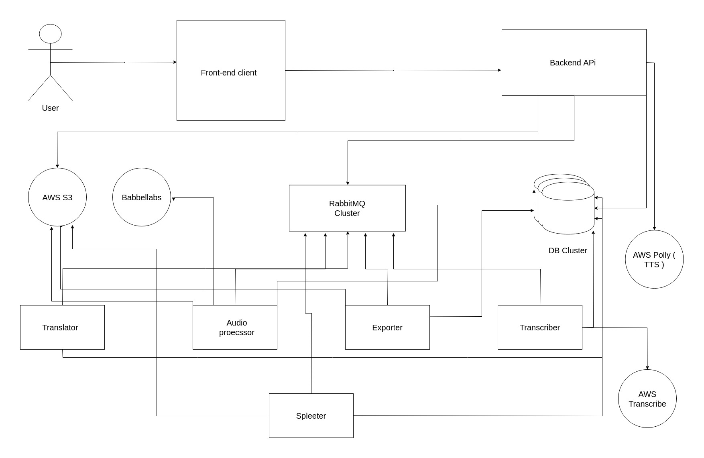

Please follow this guide to set up Videowiki locally.

## Pre-requisites:
Videowiki uses the following services. To set it up successfully please ensure
that you have working accounts for these.
- Google Cloud (for Translation and Text-to-Speech)
- AWS (for Transcription, Storage and Text-to-Sppech)
- Babble Labs (for Background Noise Cancellation)
- Mailgun (for Emails)

## Steps
1. Clone this repository
2. `cd videowiki`
3. Add your Google credentials JSON as `gsc_creds.json` here
4. Clone the individual repositories needed from the gitlab project `https://gitlab.com/videowiki`
- client
- api-gateway-service
- websockets-service
- apikey-api-service
- article-api-service
- auth-service
- comment-api-service
- email-service
- invitation-response-api-service
- noise-cancellation-video-api-service
- notification-api-service
- organization-api-service
- socket-connection-service
- storage-service
- subtitles-api-service
- text-to-speech-service
- translation-api-service
- translation-export-api-service
- user-api-service
- video-api-service
- video-tutorial-contribution-api-service
- audio-processor-service
- translator-service
- noise-cancellation-api-service
- exporter-service
- bg-music-extractor-service
- transcriber-service
- video-noise-cancellation-service

5. `cd` into each of the above and run `npm install`
6. Copy gsc_creds.json in both `translator-service` and `text-to-speech-service` directories
7. Go to the parent directory `videowiki`

### For docker-compose deployments
1. edit `docker-compose.env` to provide your credentials for services used.
2. run `node generate_conf.js` to generate the docker-compose.yml file, and kube config files ( in a subdirectory `prod`)
3. Start the application with `docker-compose up`
4. Navigate to `tvw.localhost` to access the application

### For kuberenetes deployments
1. edit `secrets.txt` to provide your credentials for services used.
2. run `node generate_conf.js` to generate the docker-compose.yml file, and kube config files ( in a subdirectory `prod`)
3. run `node generate_secrets.js` to generate the secrets file ( which encodes the secrets in secrets.txt to base64 formats compatible with kube secrets )
4. a new file will be generated named `videowikisecretkeys_secret.yml` that contains the encoded secrets file
5. apply the secrets file to your kube cluster `kubectl apply -f videowikisecretkeys_secret.yml`
6. apply the redis and rabbitmq deployments from the `meta/` directory
7. for local deployments, you can apply the generated mongo deployment in the `meta` directory, for production deployments IT'S NECESSARY to either add persistent storage to the mongo deployment on the cluster or use a provider that can provide a provisioned mongo clusters 
8. apply the config files in the directory `prod/` to your cluster `kubectl apply -f prod/`

## notes on kubernetes deployments
1. We use AWS load balancer as our ingress provider to our cluster, please find the file `prod/ingress.nginx.yml` and change accordingly 
2. every generated config file contains a deployment definition and a ClusterIP service defenition behind which the deployment reside
3. To make a global update to the settings of the cluster ( number of replicas for example ). it's better to change that in the script `generate_conf.js` instead of manually changing in all generated 30+ files. this file should be always updated to manage the cluster deployments
4. we use AWS ECR to host our built containers from where kube can fetch them, please change the variable name `DOCKER_REPO_ROOT` in the `generate_config.js` file to reflect from where kube can get the containers
5. Skaffold can be used for local development on kubes, after running `node generate_conf.js` a file named `skaffold.yml` will be generated that can be used

## Current Architecture

## Current Workflow

## Old Architecture

## Code of Conduct
[Code of Conduct](Code_of_Conduct.docx)

## Harassment Complaint Form
[Harassment Complaint Form](https://docs.google.com/forms/d/e/1FAIpQLScMR9EqywvmTrxBiDc3QQG0E50XsnCU8LO7olFQ_7yFgy2Okg/viewform)

