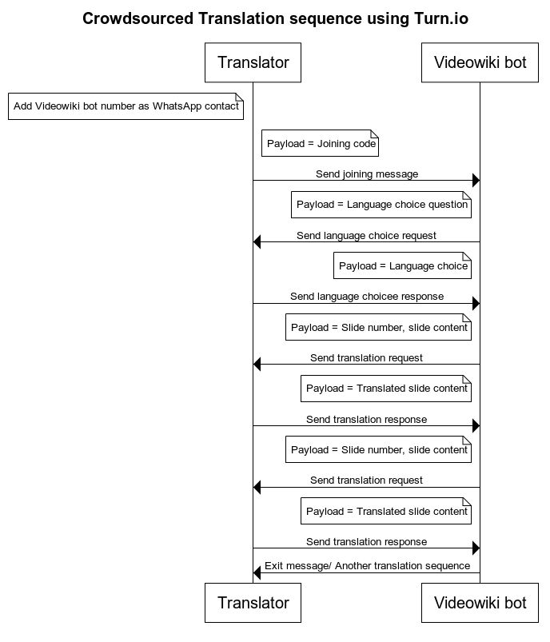
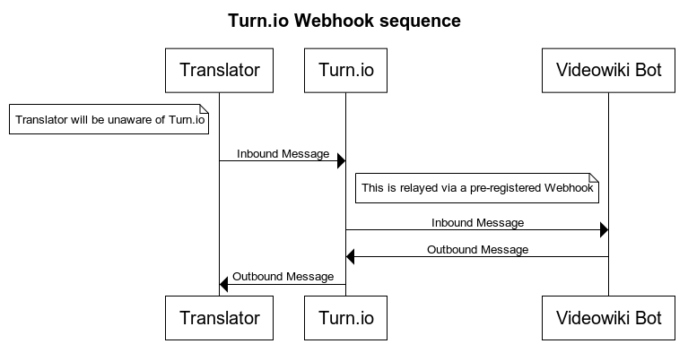

## Purpose
Videowiki aims to enagage volunteers to translate video uploaded on its platform. We have chosen to reach volunteers
for this on Whatsapp, given its reach and most potential translators familiarity with it. For this we have decided to create
a Whatsapp bot that will send slide content corresponding to a video to the Volunteer, get slide translation
from them in their chosen language and persist them in the Videowiki platform.

## Choice and Rationale
Whatsapp Business API being in beta, we need to work with a Whatsapp-authorized solution/service provider.
To select a service provider we considered
- Programmable integration abilities (We expect relaying of outbound messages via Webhooks)
- Prior experience of supporting non-profits
- Image message support (We want to use the same platform when we want to add volunteer-generated voice layovers)
We selected [turn.io][https://www.turn.io] sience they tick all the above boxes.
Others we looked at but didn't proceed with
- Morph.ai (They offer no API-driven integration abilities)
- Twilio (No support for Image messages)

## Terms
- Outbound messages:- Messages going out from the service provider platform i.e. turn.io to the Volunteer
- Inbound messages:- Message sent to the service provider by the Volunteer
These consider the platform i.e. turn.io to be the reference but from the Volunteer's point-of-view
they are only interacting with the Videowiki bot.

## Interactions
- 
- 

## Design considerations

### Assumptions
- That a Volunteer will be translating all the slides corresponding to a Video in a single conversation
- Videowiki will support multiple such conversations in parallel

### Scalability
- Will need to scale to the number of active conversations

### Failure modes
- What happens if Videowiki is unavailable when turn.io relays a message? What kind of retry policy does turn.io offer?
- Once a message has been received from turn.io, what can Videowiki do to ensure that it's not lost?

### Performance considerations
- This being a volunteer-driven activity, we should ensure that interact with Volunteers as soon as possible and there
are no high latency differences in interactions across them

### Implementation
The bot needs to integrate with rest of the Videowiki platform to reterive content to be translated and persist translations.
It needs to be ensured that a content being translated is not being retrieved again for translation. Once a translation has
reached Videowiki via turn.io it should not be lost
We can start off with a service that exposes a single endpoint that needs to be registered with turn.io as a Webhook.
This is an endpoint where we will expect turn.io to POST the Translator's message. This response  will contain the translation
which we will persist against the particular video being translated

### Questions
- Can anyone translate anything? Or is there some degree of access control?
- Is there some validation we want to have in place?
- Once a translation is complete, do we expect that to show up against the corresponding video in the UI?
Or we don't mind a certain delay or lag?

## Future directions

### Functionality
- The different slides corresponding to a video might get translated by different people
- We might want to have multiple contending translations for the same slide and choose the best using some criteria

### Implementation
- We might want to minimize interactions with the main video database since contentions and failres on that
will impede performance of the bot and then we won't be able to make most usage of turn.io's delivery capabilities.
One way to do this would be to use a local database which will maintain mappings for video, slides of the video,
translation and Translator as well as a master list of videos in need of translation. These could synced with
the main database as required.

## Dev notes
To develop you'll need a development sandbox from [app.turn.io](https://app.turn.io). A user can only authenticate
themselves via Google Auth now. Once you have an account, generate WhatsApp Business API access credentials. These
can either be time-limited, for 7 days and based of a generated username and password or longer-lived. With this
access token API requests can be made. E.g. to send text message to a user,
the [`/messages` API](https://whatsapp.turn.io/docs/index.html#text-messages) will be used.
You will also need to set up a Webhook so that inbound messages from user phones can be received.
The Webhook will be a publicly reachable endpoint that processes the inbound message relayed by `turn.io`.
For local development this can be done by setting up a tunnel to the bot service via [ngrok](https://ngrok.com/)

Both of the above i.e. token generation and Webhook set up can be accessed via `Settings->API and Webhooks`

Note:- In practice, to send a message to a Whatsapp phone number using the `/messages` API you might need to prefix the country code.

